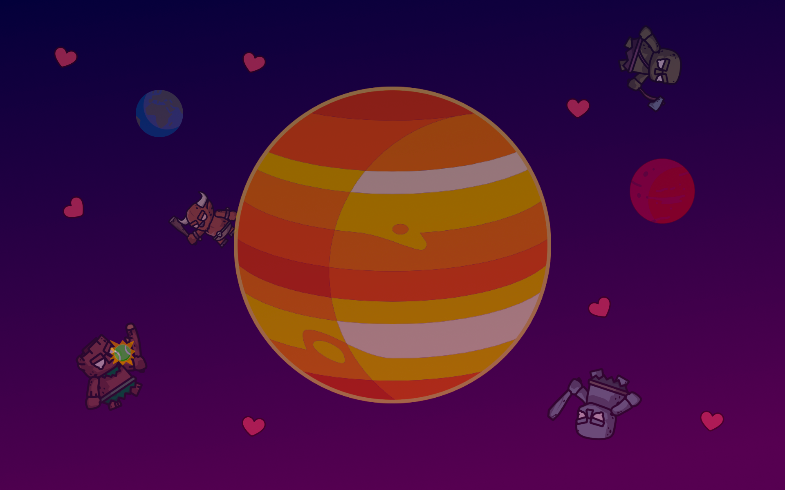

# Jupiter Shooter



## Table of Contents

- [About](#about)
- [Getting Started](#getting_started)
- [Usage](#usage)
- [Contributing](#contributing)

## 🤔About <a name = "about"></a>

---

Jupiter Shooter is web game made with Javascript, and also Html and CSS for styling and layout.
The goal of the game is simple, defeat all your opponents in the shortest amount of time.

Here's how it would look like :

### Things this project needs :

~~1. Basic Resources for the game (Characters, Audio, etc.)~~
~~2. Layout and styling of the website~~ 
3. Basic game functionality

## 🏁Getting Started <a name = "getting_started"></a>

---

Here's how you get started on developing the project, and to run the game locally on you computer. See [contribution](#deployment) for notes on how you can contribute into the project.

### Prerequisites

Things you need before installing the project

- A Text Editor / IDE (VScode is recommended, install [here](https://code.visualstudio.com/))
- Git (install [here](https://docs.github.com/en/get-started/quickstart/set-up-git))
- A Terminal
- Web browser

### Installing

A step by step guide on how get the project set up and running.

1. Clone this repository into your computer

```
git clone https://github.com/korban-mantan/Jupiter-shooter.git
```

2. Open the project with your text editor

3. Start Developing!


## 🤝Contribution <a name = "contribution"></a>

---

Feel free to contribute into this project.

### Here's how :

#### 1. Create new branch for your changes

Create new branch with the `git switch` command

```
git switch -c your-branch-name
```

#### 2. Add your changes to Git

You can add the changes to Git with the `git add` command

```
git add files_that_you've_changed
```

Or use `git add .` command to add all the files you've changed inside this directory

```
git add .
```

#### 3. Commit your changes to Git

After you're done adding changes to Git, simply commit the change with `git commit`

```
git commit -m "description of your change/commit here"
```

#### 4. Push your changes to Github

Push your changes to github with the command `git push`

```
git push -u origin your-branch-name
```

#### 5. Submit your code for review

Don't forget to submit your changes by creating a new pull request in the repository

And voila! you're pretty much done.

## Special Thanks

---

- Add your name here after contributing

## Keep in touch

<a href="https://instagram.com/diki.isme">
  
  </a>
